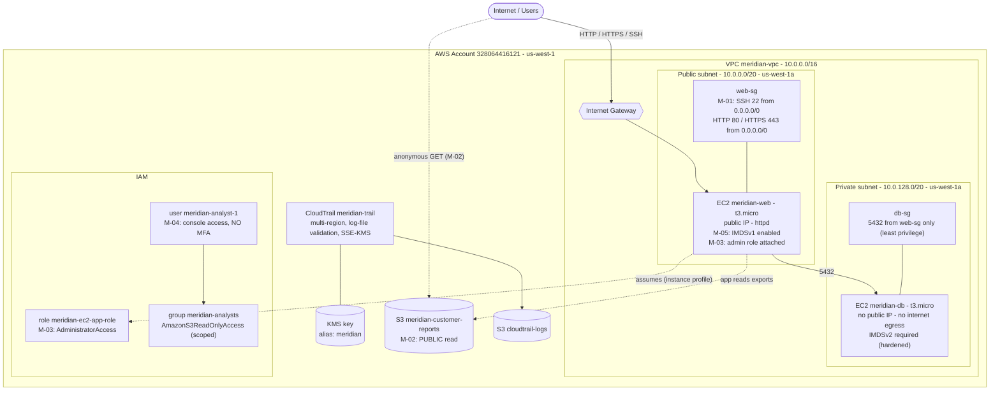

# Meridian Health Analytics — Lab Architecture

GitHub renders the Mermaid diagram below automatically. For the portfolio README you can
also export a polished PNG (draw.io / Lucidchart) to `architecture-diagram.png` in this
folder — the Mermaid version is the source of truth for *what* to draw.

## Legend — deliberate misconfigurations

| ID | Where | Weakness | Intended finding |
|---|---|---|---|
| M-01 | `web-sg` | SSH 22 open to `0.0.0.0/0` | Internet-exposed management port |
| M-02 | `meridian-customer-reports` S3 | Public Block off (bucket + account) + public-read policy | Anonymous data exfiltration |
| M-03 | `meridian-ec2-app-role` on `meridian-web` | `AdministratorAccess` on an internet-facing host | Least-privilege violation; blast radius |
| M-04 | `meridian-analyst-1` | Console user, no MFA | Credential compromise |
| M-05 | `meridian-web` | IMDSv1 still enabled | SSRF → EC2 credential theft (chains with M-03) |

## Hardened / good-practice elements (the contrast)

- `db-sg` allows `5432` only from `web-sg` (not a CIDR)
- `meridian-db` in a private subnet, no public IP, no `0.0.0.0/0` route
- `meridian-db` enforces IMDSv2
- `meridian-analysts` group carries a scoped read-only policy; `meridian-analyst-1` gets access via the group, no inline policies
- CloudTrail: multi-region, log-file validation on, KMS-encrypted
