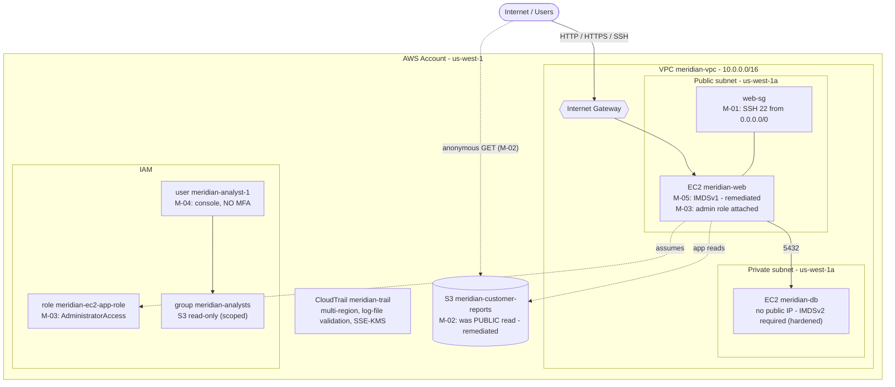

# Cybersecurity GRC Portfolio Project

> **Status:** Phases 1–6 complete. AWS lab built · 16-risk assessment · NIST CSF 2.0 mapping ·
> mock vendor assessment · SOC 2 Type II review · remediation roadmap with 2 fixes implemented
> and verified. Phase 7 (this README) is the presentation layer.

An end-to-end GRC engagement built around a small, real AWS environment. It walks a finding
from cloud misconfiguration → risk register → NIST CSF 2.0 control mapping → prioritised
remediation → verified fix, and adds two independent GRC workstreams — a mock vendor security
assessment and a SOC 2 Type II report review.

---

## Scenario — the fictional company

**Meridian Health Analytics** is an early-stage healthtech startup (~25 staff) that ingests
de-identified clinical data from partner clinics and returns population-health dashboards. It
runs entirely on AWS, holds data its customers consider sensitive, and is starting to face
security questionnaires from prospects — so it needs a defensible risk picture, a control
framework, and a remediation plan.

Every artifact is written as if produced for Meridian, to give the work real business context
rather than a checklist feel. All data is synthetic.

---

## Architecture (as assessed)

Full diagram, legend and the hardened-control contrast:
[`01-aws-lab/architecture-diagram.md`](01-aws-lab/architecture-diagram.md).

---

## Skills demonstrated

- **Cloud risk assessment on a live AWS environment** — asset inventory, threat/vulnerability
  identification, qualitative Likelihood × Impact scoring (simplified NIST SP 800-30).
- **Independent tool corroboration** — Prowler scan of the account, 116 raw findings triaged
  to signal vs. enterprise-scale noise with documented rationale.
- **Control-framework translation** — every risk mapped to a NIST CSF 2.0 subcategory with
  current-vs-target maturity ratings and a heat map.
- **Third-party / vendor risk management** — SIG-Lite-style questionnaire, weighted scorecard,
  executive recommendation memo with contractual conditions and compensating controls.
- **SOC 2 Type II report literacy** — opinion, TSC scope, carve-out subservice orgs, CUECs,
  exceptions and their customer impact; cross-checked against the vendor questionnaire.
- **Remediation planning and delivery** — prioritised roadmap with effort/cost/owner per item,
  plus two fixes implemented in the live environment and verified before/after.
- Defensible decisions throughout: documented assumptions, trade-offs, residual risk, and
  deliberate scope boundaries.

---

## Repo navigation

| Folder | Contents | Phase |
|---|---|---|
| [`01-aws-lab/`](01-aws-lab/) | Console build log with every resource ID, architecture diagram, the 5 deliberate misconfigurations, disclosure notes, teardown order | 1 |
| [`02-risk-assessment/`](02-risk-assessment/) | Asset inventory (13 assets), methodology, Prowler scan + triage, 16-risk register with scoring rationale | 2 |
| [`03-nist-csf-mapping/`](03-nist-csf-mapping/) | Risk → CSF 2.0 subcategory mapping, current/target maturity, heat map | 3 |
| [`04-vendor-assessment/`](04-vendor-assessment/) | 8-domain questionnaire answered as the vendor, weighted scorecard, recommendation memo | 4 |
| [`05-soc2-review/`](05-soc2-review/) | Structured SOC 2 Type II review — scope, CUECs, exceptions, bridge letter, questionnaire cross-check | 5 |
| [`06-remediation-plan/`](06-remediation-plan/) | Full remediation roadmap, phased 0–30 / 30–90 / 90+ plan, before/after evidence for implemented fixes | 6 |
| [`docs/screenshots/`](docs/screenshots/) | AWS console evidence referenced across the repo | all |

---

## Results by phase

| Phase | Output | Headline result |
|---|---|---|
| 1 · AWS lab | Multi-service environment (VPC, 2× EC2, S3, IAM, CloudTrail, KMS) built in the console | 5 deliberate misconfigurations planted and documented; a hardened DB tier as the contrast |
| 2 · Risk assessment | 16-risk register, Prowler scan | 2 critical, 4 high, 8 medium, 2 low — 5 by design, 11 surfaced by the scan |
| 3 · CSF mapping | Risk → CSF 2.0, maturity gaps, heat map | 14 / 16 risks are PROTECT gaps, concentrated in identity/access (PR.AA) and data protection (PR.DS); DETECT near-absent |
| 4 · Vendor assessment | Questionnaire + scorecard + memo | Vendor scored 2.60 / 4.00 (Medium) → **approve with conditions**: 7 contractual conditions, 5 compensating controls |
| 5 · SOC 2 review | Structured review notes | Report supports the decision; flagged Privacy TSC out of scope, AWS carved out, one late access review, ~3-month currency gap |
| 6 · Remediation | Roadmap + 2 implemented fixes | **R-01 (critical)** public bucket closed — anonymous access `200 → 403`; **R-04 (high)** IMDSv2 enforced; remaining 12 scheduled across 0–30 / 30–90 day windows |

---

## Resume bullets

> Built a multi-service AWS environment (VPC, EC2, S3, IAM, CloudTrail, KMS) and ran an
> independent Prowler scan; produced a 16-risk register (2 critical, 4 high) with a simplified
> NIST SP 800-30 method, separating 5 seeded misconfigurations from 11 the scan surfaced.

> Mapped all 16 risks to NIST CSF 2.0 subcategories with current-vs-target maturity ratings
> and a control heat map, identifying that 14 of 16 were PROTECT-function gaps concentrated in
> identity and data protection.

> Delivered a prioritised remediation roadmap (0–30 / 30–90 / 90+ day windows, effort and cost
> per item) and implemented two of the highest-priority fixes in the live environment —
> closing a critical public-S3 exposure (verified anonymous access `200 → 403`) and enforcing
> IMDSv2 against instance-credential theft.

> Ran a mock third-party security assessment — SIG-Lite-style questionnaire, weighted
> scorecard, and an executive "approve-with-conditions" memo — and reviewed the vendor's
> SOC 2 Type II report, cross-checking it against the questionnaire responses.

---

## Tools & frameworks

NIST CSF 2.0 · NIST SP 800-30 · AICPA SOC 2 Trust Services Criteria · SIG Lite ·
AWS (VPC, EC2, S3, IAM, CloudTrail, KMS, CloudShell) · Prowler (open-source cloud scanner) ·
Git / GitHub. Lab built in the AWS console; Terraform noted as an optional future rebuild.

---

## Walkthroughs

_3–5 minute Loom walkthrough per phase — links added as recorded._

- Phase 1–3 (lab → risk assessment → CSF): _tbd_
- Phase 4–5 (vendor assessment → SOC 2 review): _tbd_
- Phase 6 (remediation + implemented fixes): _tbd_

---

## Notes

- **Spreadsheet artifacts** are kept as `.csv` (not `.xlsx`) so they diff cleanly in version
  control; open in Excel/Sheets and export if a spreadsheet is preferred.
- **All data is synthetic.** No real personal or clinical data is used anywhere.
- **Cost control:** no NAT gateway or Elastic IPs; EC2 instances stopped between sessions;
  a $5/month budget alert is configured. Idle spend ≈ $2–3/month.
- **Disclosure:** screenshots were reviewed before commit; the AWS account ID is visible in
  ARNs/bucket names and is accepted as low-sensitivity (see
  [`01-aws-lab/lab-notes.md`](01-aws-lab/lab-notes.md)).
- **Teardown order** for the lab is documented in
  [`01-aws-lab/lab-notes.md`](01-aws-lab/lab-notes.md).
